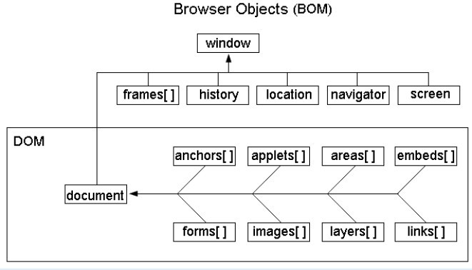

# 什么是DOM？
1.用一组结构化的节点以及对象来表示文档。本质上就是将网页和脚本语言以及编程语言连接起来。  
2.DOM 可被 JavaScript 用来读取、改变 HTML、XHTML 以及 XML 文档。  
3.主要要为：微软DOM与W3C DOM，一般IE实现的是微软DOM，而其它浏览器则不同程度的实现了W3C DOM。  
##### DOM与BOM的关系：BOM包含DOM

##### DOM 被分为不同的部分（核心、XML及HTML）和级别（DOM Level 1/2/3）：
       Core DOM 
              定义了一套标准的针对任何结构化文档的对象 
       XML DOM 
              定义了一套标准的针对 XML 文档的对象 
       HTML DOM 
              定义了一套标准的针对 HTML 文档的对象。
              
#节点基础
###文档根节点
	var de = document.documentElement;
	alert(de.tagName);
###获取head与body
	//本来可以使用getElementsByTagName的
	var head = document.getElementsByTagName("head")[0];
	var body = document.getElementsByTagName("body")[0];
###常用节点类型
    元素节点——文档中具有标签的节点
    文本节点——标签中不是注释的文本块
###常用的节点属性
    nodeType——节点类型，元素节点是1，文本节点是3
    nodeValue——节点值，元素节点为空，文本节点的nodeValue属性即为文本内容
    firstChild——该元素节点包含的第一个子节点
    lastChild——该元素节点包含的最后一个子节点
    nextSibling——该节点的后一个兄弟节点
    previousSibling——该节点的前一个兄弟节点
    childNodes——子节点列表,可以通过node.childNodes[index]（或node.childNodes.item(index)）来获取子节点
    nodeName——节点名称，对于元素节点，返回tagName,对于文本，则返回#text
###考虑下面的HTML代码所表示的节点结构
	
 Some Text 

    上面的HTML代码将会解析成两个节点:元素节点——p标签，文本节点——Some Text.也就是说，标签中包含的一些文本也是节点，那么空格之类的非打印字符会不会被当作文本节点呢？
    不同浏览器在判断何为Text节点上存在一些差异。某些浏览器，如Mozilla，认为元素之间的空白(包括换行符)都是Text节点；而另一些浏览器，如IE，会全部忽略这些空白!!
	var de = document.documentElement;
	var head = de.firstChild;//html下面第一个元素，可能是head
	var body = de.lastChild;//html下面最后一个元素，可能是body
    答案并不确定，但是仍然有办法解决——使用节点类型检测,每个节点都有nodeType属性，指明它的节点类型。对于元素节点，它的值是1，而对于文本节点，它的值是3
	var de = document.documentElement;
	var head = de.firstChild.nodeType==1?de.firstChild:de.firstChild.nextSibling;
	var body = de.lastChild.nodeType==1?de.lastChild:de.lastChild.previousSibling;]
	//还可以使用childNodes
	var de = document.documentElement;
	var head = de.childNodes[0].nodeType==1?de.childNodes[0]:de.childNodes[0].nextSibling;
	var head = de.childNodes[1].nodeType==1?de.childNodes[1]:de.childNodes[1].previousSibling;
	
#HTML DOM
###HTML DOM用对象来表示HTML标签,考虑下面的代码——
	
	//对于上面的img标签，浏览器解析时会将其转换成下面的对象
	{
		src:"../images/stack_heap.jpg",
		alt:"内存堆栈",
		onclick:"alert('Hello!')",
		tagName:"IMG"
	};
	//其实不止这些属性
######一般所说的DOM是指XML DOM，而W3C也为HTML页面提供了更快捷的DOM——HTML DOM!使用HTML DOM，能使访问HTML标签的属性就像访问JavaScript创建的对象的属性一样简单.
	var imgObj = document.getElementById("imgObj");
	alert(imgObj.src);//获取src属性如此简单
######使用HTML DOM也使得访问页面一些元素变得更加简单
	var bodyTag = document.documentElement.lastChild;//DOM标准方式
	bodyTag = document.body;//HTML DOM方式
	var titleTag = document.getElementsByTagName("title")[0].firstChild.nodeValue;//DOM标准方式
	titleTag = document.title;//HTML DOM方式
	//HTML DOM不仅仅可以用来获取内容，也可以设置
	document.title ="Change The Title!!!";  	
######获取节点：
    1.document.getElementById("")
      document.getElementByTagName("")
######写入文本：
    2.document.write("")
######元素写入文本：
    3.document.getElementById("").innerHTML = "';
######修改属性	
    4.document.getElementById("").attribute = ""
	  document.getElementById("image").src="landscape.jpg";
######修改样式 
    5.document.getElementById("").style.property = new style;
	  document.getElementById("p2").style.color="blue";
######添加事件 
    6.document.getElementById("").onclick = function;
	  onclick,onload,onunload,onchange,onmouseover,onmouseout,onmousedown,onmouseup,onfocus
######添加节点
	整个文档是一个文档节点
	每个 HTML 元素是元素节点
	HTML 元素内的文本是文本节点
	每个 HTML 属性是属性节点
	注释是注释节点
	parentNode
	childNodes
	attributes 
	firstChild
	lastChild
	nextSibling
	previousSibling
	var para = document.createElement("p");
	var node = document.createTextNode("asdasd");
	para.appendChild(node);
	parent.removeChild(child);
	child.parentNode.removeChild(child);
#window对象：
    alert方法，弹出消息对话框。
    confirm方法，显示“确定”、“取消”对话框。
    navigate方法，重新导航到指定的地址。
    setInterval每隔一段时间执行指定的代码，第一个参数为代码的字符串，第二个参数为间隔时间（单位毫秒），返回值为定时器的标识
    clearInterval取消setInterval的定时执行，相当于Timer中的Enabled=False。因为setInterval可以设定多个定时，所以clearInterval要指定清除那个定时器的标识，即setInterval的返回值。
    setTimeout也是定时执行，但是不像setInterval那样是重复的定时执行，只执行一次。
    clearTimeout也是清除定时。
    showModalDialog弹出模态对话框。
    showModelessDialog弹出非模态窗口。
    window.location.href='http://www.baidu.com'，重新导向新的地址。
    window.location.reload() 刷新页面。
    window.event是非常重要的属性，用来获得发生事件时的信息，事件不局限于window对象的事件，所有元素的事件都可以通过event属性取到相关信息。
    clientX、clientY 发生事件时鼠标在客户区的坐标；
    screenX、screenY 发生事件时鼠标在屏幕上的坐标；
    offsetX、offsetY 发生事件时鼠标相对于事件源（比如点击按钮时触发onclick）的坐标。
    .srcElement，获得事件源对象。几个事件共享一个事件响应函数用。
    keyCode，发生事件时的按键值。
    button，发生事件时鼠标按键，1为左键，2为右键，3为左右键同时按。
            altKey属性，bool类型，表示发生事件时alt键是否被按下，类似的还有ctrlKey、shiftKey属性
    screen对象，屏幕的信息
    clipboardData对象，对粘贴板的操作。clearData("Text")清空粘贴板；getData("Text")读取粘贴板的值，返回值为粘贴板中的内容；setData("Text",val)，设置粘贴板中的值。
    【<input type="button" value="推荐给好友" onclick="clipboardData.setData('Text','推荐给你一个网站，很好玩'+location.href);alert('已经将网址放到粘贴板中，发给你的好友即可');"/>
       重复帐号：<input type="text" onpaste="alert('为保证帐号的正确，请勿粘贴帐号');return false;" />】
    【clipboardData.setData('Text', clipboardData.getData('Text') + '本文来rohelm博客，转载请注明来源。' + location.href);】
#body对象的事件
    onload：网页加载完毕时触发。
    onunload：网页关闭（或者离开）后触发。
    onbeforeunload：在网页准备关闭（或者离开）后触发。在事件中为"window.event.returnValue赋值（要显示的警告消息），这样窗口离开（比如前进、后退、关闭）就会弹出确认消息
#document对象的事件
    document.write('你好');
    getElementById方法，根据元素的Id获得对象,getElementsByName返回值是对象数组。
    getElementsByTagName，获得指定标签名称的元素数组。
    createElement方法来创建具有指定标签的DOM对象，然后通过调用某个元素的appendChild方法将新创建元素添加到相应的元素下。
    几乎所有DOM元素都有innerText、innerHTML属性（注意大小写），分别是元素标签内内容的文本表示形式和HTML源代码，这两个属性是可读可写的。

